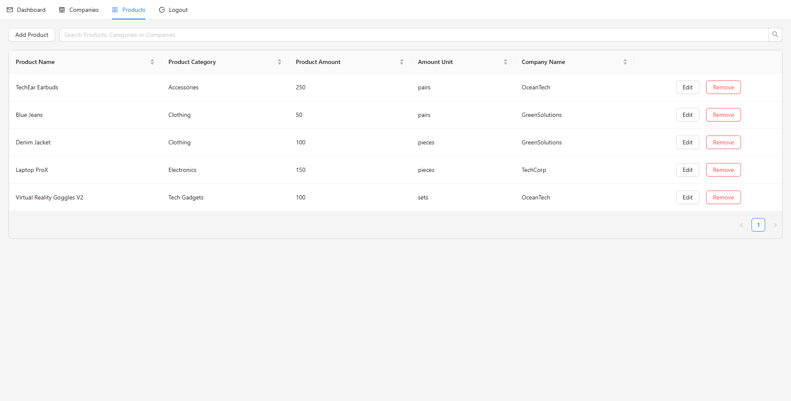

# Company Dashboard

### Prerequisites

- [Node.js](https://nodejs.org/)
- [npm](https://www.npmjs.com/)

### Installation

1. Clone the repository:

   ```
   git clone <https://github.com/mertkurtoglu/CompanyDashboard.git>
   ```

2. Install backend dependencies:
   ```
   npm install
   ```
3. Install frontend dependencies:
   ```
   cd client
   npm install
   ```

### Running the project

1. Start the backend server:

   ```
   npm start
   ```

2. Start the frontend:
   ```
   cd client
   npm start
   ```

Your frontend should now be running on [http://localhost:3000] and backend on the [http://localhost:8080]

## Built With

- [Node.js](https://nodejs.org/) - Backend framework
- [React](https://reactjs.org/) - Frontend library
- [Antd](https://ant.design/)

   
   
   
   
   
